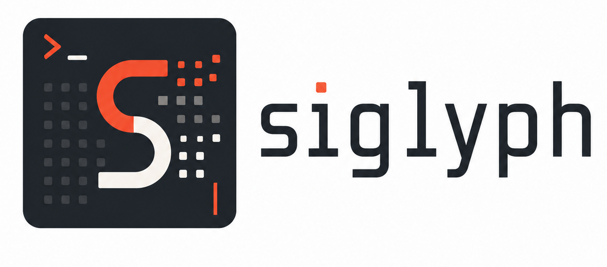

# siglyph

<p align="center">
  
</p>

[](https://github.com/zikolach/siglyph/actions/workflows/ci.yml)

**siglyph** is a Scala 3 terminal UI library inspired by [`pi-tui`](https://github.com/earendil-works/pi/tree/main/packages/tui). It provides dependency-light components, typed terminal input, Unicode-aware text editing, differential rendering, overlays, and JVM/Scala Native terminal backends.

The public Scala package namespace is `scalatui`.

## Demo

[](https://asciinema.org/a/UznjMGz4rWVWwLXm)

This clip shows a prompt composer built with siglyph components: typed input, slash completion, file attachment completion, and tag completion. More recordings are listed in [`docs/asciinema-demos.md`](docs/asciinema-demos.md).

## Status

siglyph is pre-1.0. The current focus is a small, testable TUI core with `pi-tui`-style editing and input behavior. macOS and Linux are the target platforms; Windows and Scala.js/browser support are out of scope for now.

## Install

Published artifacts are available on Maven Central. GitHub Packages and GitHub Release jars are also published for releases; details live in [`docs/publishing.md`](docs/publishing.md).

### SBT

```scala
libraryDependencies ++= Seq(
  "io.github.zikolach" %% "siglyph-core" % "0.3.0",
  "io.github.zikolach" %% "siglyph-terminal-jvm" % "0.3.0",
  "io.github.zikolach" %% "siglyph-markdown" % "0.3.0",
  "io.github.zikolach" %% "siglyph-image" % "0.3.0"
)
```

### Mill

```scala
object app extends ScalaModule {
  def scalaVersion = "3.7.4"

  def mvnDeps = Seq(
    mvn"io.github.zikolach::siglyph-core::0.3.0",
    mvn"io.github.zikolach::siglyph-terminal-jvm::0.3.0",
    mvn"io.github.zikolach::siglyph-markdown::0.3.0",
    mvn"io.github.zikolach::siglyph-image::0.3.0"
  )
}
```

To include optional `siglyph-extras`, add it to your dependency list:

- **SBT:** `"io.github.zikolach" %% "siglyph-extras" % "0.3.0"`
- **Mill:** `mvn"io.github.zikolach::siglyph-extras::0.3.0"`

### Maven for Java and Kotlin JVM apps

Replace `VERSION` with a published release that includes the JVM interop facade.

```xml
<dependencies>
  <dependency>
    <groupId>io.github.zikolach</groupId>
    <artifactId>siglyph-core_3</artifactId>
    <version>VERSION</version>
  </dependency>
  <dependency>
    <groupId>io.github.zikolach</groupId>
    <artifactId>siglyph-terminal-jvm_3</artifactId>
    <version>VERSION</version>
  </dependency>
</dependencies>
```

### Gradle for Java and Kotlin JVM apps

Replace `VERSION` with a published release that includes the JVM interop facade.

```kotlin
implementation("io.github.zikolach:siglyph-core_3:VERSION")
implementation("io.github.zikolach:siglyph-terminal-jvm_3:VERSION")
```

Scala JVM applications usually start with `siglyph-core` and `siglyph-terminal-jvm` through Scala build-tool syntax such as `%%` or Mill `::`. Java and Kotlin JVM applications use the concrete JVM artifact IDs `siglyph-core_3` and `siglyph-terminal-jvm_3`, and can use `scalatui.terminal.jvm.interop.SiglyphJvm` for a narrow Java-friendly facade. Scala Native applications use the platform-aware `siglyph-core` coordinates along with `siglyph-terminal-native`; Mill resolves those to `_native0.5_3` artifacts from `ScalaNativeModule` projects. The Java/Kotlin facade is JVM-only; Scala Native artifacts remain Scala-focused.

## Try with Scala CLI

Single-file demos live in [`examples/scala-cli/`](examples/scala-cli/) and are intended for copy/paste or GitHub Gist use. For example:

```bash
./examples/scala-cli/markdown.scala
./examples/scala-cli/image.scala /path/to/image.png
```

They reference Maven Central dependencies, so they can run without cloning or GitHub Packages credentials.

## Quick example

A small JVM app with text, input, focus, and terminal lifecycle:

```scala
import scalatui.components.*
import scalatui.core.TUI
import scalatui.terminal.jvm.SttyTerminal

@main def helloTui(): Unit =
  val tui = TUI(SttyTerminal())
  val input = Input()
  input.onSubmit = value =>
    input.setValue("")
    tui.addChild(Text(s"You typed: $value"))

  tui.addChild(Text("siglyph demo — type and press Enter"))
  tui.addChild(input)
  tui.setFocus(input)
  tui.run()
```

The JVM interop facade gives Java and Kotlin call sites the same basic path without Scala default-argument methods or Scala function types. Scala, Java, and Kotlin versions of the basic example are in [`docs/jvm-language-examples.md`](docs/jvm-language-examples.md).

A multiline editor with slash, filesystem, attachment, fuzzy, and `#` trigger autocomplete:

```scala
import java.io.File
import scalatui.autocomplete.*
import scalatui.components.*
import scalatui.core.TUI
import scalatui.terminal.jvm.SttyTerminal

@main def editorTui(): Unit =
  val tags = Vector("#bug", "#docs", "#demo")
  TriggerCompletionSource.fromPrefix(
    "#",
    query => Some(tags.filter(_.drop(1).startsWith(query)).map(tag =>
      AutocompleteItem(tag.drop(1), tag, Some("application-owned tag"))
    ))
  ) match
    case Left(error) =>
      System.err.println(s"Invalid autocomplete trigger: ${error.message}")
    case Right(tagSource) =>
      val tui = TUI(SttyTerminal())
      val provider = CombinedAutocompleteProvider(
        commands = Vector(SlashCommand("help"), SlashCommand("quit")),
        pathProvider = Some(FileSystemPathCompletionProvider(FileSystemPathCompletionOptions(
          baseDirectory = File("."), // Java/NIO only; no fd/find/shell dependency
          maxResults = 20
        ))),
        triggerSources = Vector(tagSource),
        fuzzyRanking = AutocompleteFuzzyRanking.Enabled
      )
      val editor = Editor(options = EditorOptions(
        autocompleteProvider = Some(provider),
        // Debounce is explicit/injectable; pending requests are cancelled and late results ignored.
        autocompleteDebouncer = EditorAutocompleteDebouncer.Immediate,
        onSubmit = text => println(s"Submitted: $text")
      ))

      tui.addChild(Text("Try /he, ./, @\"README, or #do then Tab"))
      tui.addChild(editor)
      tui.setFocus(editor)
      tui.run()
```

## Optional helper modules

Markdown rendering stays in `siglyph-markdown`. The baseline renderer is dependency-free and supports theme hooks, readable link fallback, OSC 8 links when `TerminalCapabilities.hyperlinks` is true, parser adapters, optional fenced-code highlighter hooks, normalized list markers by default, and opt-in source list marker preservation with `MarkdownRenderOptions(preserveSourceListMarkers = true)`. Task-list markers render as visible text; they are not interactive checkboxes.

Image rendering stays in `siglyph-image`. `ImageSource.fromFile(path)` loads supported PNG, JPEG, GIF, and WebP files into base64 data, MIME type, and dimensions for the existing `Image` component contract. Unsupported terminals render readable fallback text. The `Image` component uses runtime cell-size replies by default; pass `ImageRenderOptions(cellDimensionsSource = ImageCellDimensionsSource.Fixed, cellDimensions = ...)` for deterministic fixed sizing. `examples/scala-cli/image.scala` is the quickest visual smoke test for protocol rendering, fallback behavior, runtime cell-size sizing in supported versions, and row reservation (see `examples/scala-cli/README.md` for running it against local sources from this checkout).

Expandable helpers stay in `siglyph-extras`. The module depends only on `siglyph-core` and provides reusable compact/detail widgets without terminal backend, Markdown, image, demo, agent-session, LLM message, tool execution, extension runtime, model-selection, or message-history APIs.

```scala
import scalatui.extras.*

val details = ExpandableText(
  collapsedText = "Build finished",
  expandedText = "Build finished with 14 tests and no failures",
  paddingX = 1
)

val section = ExpandableSection(
  title = "Output",
  collapsedBody = "2 lines hidden",
  expandedBody = "line 1\nline 2",
  hintText = Some("Ctrl+O toggles details")
)

val controller = ExpansionController()
controller.register(details)
controller.register(section)
controller.setExpanded(true)
```

## Terminal integration helpers

`TUI` exposes optional terminal integration helpers for supported interactive backends:

```scala
val tui = TUI(SttyTerminal())
val unsubscribe = tui.onTerminalColorSchemeChange { scheme =>
  println(s"terminal scheme changed to ${scheme.value}")
}

tui.start()
try
  val titleApplied = tui.setTerminalTitle("siglyph")
  val progressApplied = tui.setTerminalProgress(active = true)
  val background = tui.queryTerminalBackgroundColor(timeoutMillis = 500)
  val scheme = tui.queryTerminalColorScheme(timeoutMillis = 500)
  tui.setTerminalColorSchemeNotifications(enabled = true)
finally
  unsubscribe()
  tui.stop()
```

Title and progress helpers return `false` when the backend does not support the protocol. Color queries and notifications require a started TUI so the backend can read and deliver terminal replies. `TUI` owns query correlation, timeouts, and protocol-reply interception before focused components receive input.

## Input and editor integration hooks

Applications can register typed global input listeners with `tui.addInputListener`. The listener receives `TerminalInput` before focused component routing. Return `InputResult.Ignored` to let normal routing continue, `InputResult.Handled(...)` to consume the input, or `InputResult.Exit` to stop through the normal terminal restoration path. The returned function removes the listener.

The editor exposes `insertAtCursor(text)` for application-owned insertion such as selected file paths or templates. It uses the same buffer mutation path as editor input: newline normalization, large-paste markers, undo, change callbacks, active autocomplete refresh, and render requests when attached to a `TUI`.

Forced autocomplete can opt into `pi-tui`-style single-result application with `EditorOptions(autoApplySingleForcedCompletion = true)`. The default remains explicit selection. Empty results, multiple results, and stale results keep the existing safe behavior.

## Demos

The demos are the best starting point for real usage:

| Command | Source | What it shows |
| --- | --- | --- |
| `mill demo.run` | [`demo/src/scalatui/demo/MvpDemo.scala`](demo/src/scalatui/demo/MvpDemo.scala) | non-interactive rendering through `StreamTerminal` |
| `mill asciinemaDemo.run agent-prompt` | [`asciinemaDemo/src/scalatui/demo/AsciinemaDemo.scala`](asciinemaDemo/src/scalatui/demo/AsciinemaDemo.scala) | deterministic recording scenario for the agent prompt composer |
| `mill asciinemaDemo.run command-palette` | [`asciinemaDemo/src/scalatui/demo/AsciinemaDemo.scala`](asciinemaDemo/src/scalatui/demo/AsciinemaDemo.scala) | deterministic recording scenario for command palette, loader, and settings behavior |
| `mill asciinemaDemo.run unicode-input` | [`asciinemaDemo/src/scalatui/demo/AsciinemaDemo.scala`](asciinemaDemo/src/scalatui/demo/AsciinemaDemo.scala) | deterministic recording scenario for Unicode-safe editing and typed terminal input |
| `mill interactiveJvmDemo.run` | [`interactiveJvmDemo/src/scalatui/demo/InteractiveJvmDemo.scala`](interactiveJvmDemo/src/scalatui/demo/InteractiveJvmDemo.scala) + [`interactiveDemo/src/scalatui/demo/InteractiveDemo.scala`](interactiveDemo/src/scalatui/demo/InteractiveDemo.scala) | interactive JVM app, editor, autocomplete, rich SelectList/SettingsList behavior, file-manager mode, loaders, terminal integration helpers, resize-safe rendering |
| `mill interactiveNativeDemo.nativeLink && ./out/interactiveNativeDemo/nativeLink.dest/out` | [`interactiveNativeDemo/src/scalatui/demo/InteractiveNativeDemo.scala`](interactiveNativeDemo/src/scalatui/demo/InteractiveNativeDemo.scala) | Scala Native launcher for the shared interactive demo |
| `mill keyTester.run` | [`keyTester/src/scalatui/demo/KeyTester.scala`](keyTester/src/scalatui/demo/KeyTester.scala) | typed terminal key/input inspection |

For the Scala Native interactive demo, `nativeLink` builds the executable and the linked binary starts the app. Run both from an interactive terminal with `mill interactiveNativeDemo.nativeLink && ./out/interactiveNativeDemo/nativeLink.dest/out`. Optional flags go after the binary path, for example `mill interactiveNativeDemo.nativeLink && ./out/interactiveNativeDemo/nativeLink.dest/out --hardware-cursor`.

Asciinema recording scenarios are documented in [`docs/asciinema-demos.md`](docs/asciinema-demos.md). Recording writes optional `.cast` publishing artifacts under `artifacts/asciinema`; normal build, test, formatting, lint, and OpenSpec validation commands do not require asciinema.

Interactive demo controls are also summarized in [`docs/interactive-smoke.md`](docs/interactive-smoke.md). Default keybindings are listed in [`docs/keybinding-defaults.md`](docs/keybinding-defaults.md).

## Features

- **Rendering core:** `Component`, `Focusable`, `Container`, differential terminal output, overlays, virtual terminal tests.
- **Components:** `Text`, `Box`, `Spacer`, `Input`, `Editor`, `SelectList`, `SettingsList`, `Loader`, `CancellableLoader`. `SelectList` and `SettingsList` support theme hooks, filtering, optional fuzzy ranking, and settings submenus through existing overlay contracts.
- **Editing:** Unicode/grapheme-aware movement and deletion, large-paste compaction, prompt history, undo, kill-ring, yank/yank-pop, page movement, jump-to-character.
- **Keybindings:** shared `KeybindingManager` with configurable editor/input/select command bindings. Typed key events can distinguish press, repeat, release, and the Insert key when terminals report that metadata.
- **Autocomplete:** slash commands, dependency-free filesystem path and `@` attachment completions, application-owned natural triggers such as `#`, optional fuzzy ranking, cancellable async providers, injectable debounce scheduling, and opt-in forced single-result auto-apply.
- **Terminals:** JVM `stty` backend, Scala Native POSIX backend, stream and virtual test backends, optional title/progress helpers, optional input drain support, runtime-owned background color and color-scheme queries, conservative Kitty keyboard protocol hooks, and readable fallback behavior when advanced metadata is unavailable.
- **Optional modules:** dependency-free Markdown rendering with theme/link/highlighter/parser hooks, terminal image protocol helpers with file loading and cell-size bounding helpers, and reusable extras widgets for expandable text, sections, and shared expansion state.

## Repository structure

```text
core/                    shared core APIs, components, editing, terminal abstractions, tests
terminalJvm/             JVM Unix/stty backend
terminalNative/          Scala Native POSIX backend
markdown/                Markdown parser/renderer module
image/                   Image component module
extras/                  Optional reusable helper widgets
demo/                    non-interactive stream-render demo
asciinemaDemo/           deterministic asciinema recording scenarios
interactiveDemo/         shared interactive demo UI/logic
interactiveJvmDemo/      JVM interactive demo launcher
interactiveNativeDemo/   Native interactive demo launcher
keyTester/               JVM terminal key tester
docs/                    usage notes, porting notes, smoke-test notes
scripts/                 generation and local recording scripts
openspec/                active and promoted OpenSpec change/spec artifacts
```

## Development

### Explicit BSP installation

```bash
mill --bsp-install
```

### IntelliJ IDEA XML Support

```bash
mill mill.idea/
```

### Project build and validation

```bash
mill __.compile
mill __.test
mill scalafmtCheck
mill scalafixCheck
openspec validate --all --strict
```

Useful focused commands:

```bash
mill core.test
mill core.test.testOnly scalatui.components.EditorSuite
mill interactiveDemo.test
```

See [CONTRIBUTING.md](CONTRIBUTING.md) for contribution workflow and style notes.

## Attribution

siglyph is inspired by and partially ported from [`pi-tui`](https://github.com/earendil-works/pi/tree/main/packages/tui), part of the MIT-licensed `pi` project. See [NOTICE](NOTICE) for upstream attribution.

## License

siglyph is licensed under the [MIT License](LICENSE).
