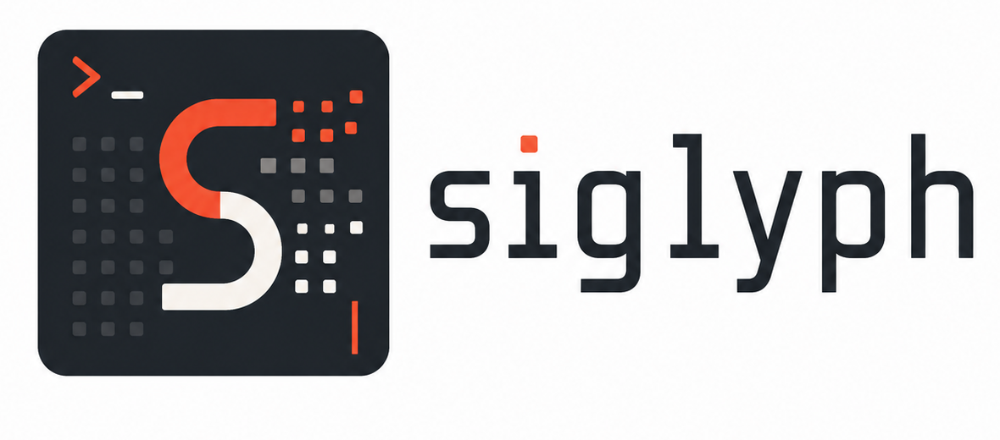

# siglyph

<p align="center">
  
</p>

[](https://github.com/zikolach/siglyph/actions/workflows/ci.yml)

**siglyph** is a Scala 3 terminal UI library inspired by [`pi-tui`](https://github.com/earendil-works/pi/tree/main/packages/tui). It provides dependency-light components, typed terminal input, Unicode-aware text editing, differential rendering, overlays, and JVM/Scala Native terminal backends.

The public Scala package namespace is `scalatui`.

We use OpenAI GPT-5.6 to assist with development, testing, and code review.

## Demo

[](https://asciinema.org/a/UznjMGz4rWVWwLXm)

This clip shows a prompt composer built with siglyph components: typed input, slash completion, file attachment completion, and tag completion. More recordings are listed in [`docs/asciinema-demos.md`](docs/asciinema-demos.md).

## Status

siglyph is pre-1.0. The current focus is a small, testable TUI core with `pi-tui`-style editing and input behavior. macOS and Linux are the target platforms; Windows and Scala.js/browser support are out of scope for now.

The version-pinned feature and behavior comparison is maintained in
[`docs/pi-tui-compatibility.md`](docs/pi-tui-compatibility.md). Siglyph has height-aware fullscreen,
stack, scroll, search, mouse-region, selection, and image-clipping support. Named gaps and
intentional deviations remain. This README does not claim drop-in APIs or complete current upstream
parity.

## Install

Published artifacts are available on Maven Central. GitHub Packages and GitHub Release jars are also published for releases; details live in [`docs/publishing.md`](docs/publishing.md).

### SBT

```scala
libraryDependencies ++= Seq(
  "io.github.zikolach" %% "siglyph-core" % "0.9.0",
  "io.github.zikolach" %% "siglyph-terminal-jvm" % "0.9.0",
  "io.github.zikolach" %% "siglyph-markdown" % "0.9.0",
  "io.github.zikolach" %% "siglyph-image" % "0.9.0"
)
```

### Mill

```scala
object app extends ScalaModule {
  def scalaVersion = "3.7.4"

  def mvnDeps = Seq(
    mvn"io.github.zikolach::siglyph-core::0.9.0",
    mvn"io.github.zikolach::siglyph-terminal-jvm::0.9.0",
    mvn"io.github.zikolach::siglyph-markdown::0.9.0",
    mvn"io.github.zikolach::siglyph-image::0.9.0"
  )
}
```

To include optional `siglyph-extras`, add it to your dependency list:

- **SBT:** `"io.github.zikolach" %% "siglyph-extras" % "0.9.0"`
- **Mill:** `mvn"io.github.zikolach::siglyph-extras::0.9.0"`

For Scala Native versions that include optional Native artifacts, add these platform-aware Mill coordinates from a `ScalaNativeModule` in addition to `siglyph-core` and `siglyph-terminal-native`:

```scala
mvn"io.github.zikolach::siglyph-markdown::VERSION"
mvn"io.github.zikolach::siglyph-image::VERSION"
mvn"io.github.zikolach::siglyph-extras::VERSION"
```

### Maven for Java and Kotlin JVM apps

Replace `VERSION` with a published release that includes the JVM interop facade.

```xml
<dependencies>
  <dependency>
    <groupId>io.github.zikolach</groupId>
    <artifactId>siglyph-core_3</artifactId>
    <version>VERSION</version>
  </dependency>
  <dependency>
    <groupId>io.github.zikolach</groupId>
    <artifactId>siglyph-terminal-jvm_3</artifactId>
    <version>VERSION</version>
  </dependency>
</dependencies>
```

### Gradle for Java and Kotlin JVM apps

Replace `VERSION` with a published release that includes the JVM interop facade.

```kotlin
implementation("io.github.zikolach:siglyph-core_3:VERSION")
implementation("io.github.zikolach:siglyph-terminal-jvm_3:VERSION")
```

Scala JVM applications usually start with `siglyph-core` and `siglyph-terminal-jvm` through Scala build-tool syntax such as `%%` or Mill `::`. Java and Kotlin JVM applications use the concrete JVM artifact IDs `siglyph-core_3` and `siglyph-terminal-jvm_3`, and can use `scalatui.terminal.jvm.interop.SiglyphJvm` for a narrow Java-friendly facade. Scala Native applications use platform-aware coordinates such as `siglyph-core`, `siglyph-terminal-native`, `siglyph-markdown`, `siglyph-image`, and `siglyph-extras`; Mill resolves those to `_native0.5_3` artifacts from `ScalaNativeModule` projects when the release includes those Native variants. The Java/Kotlin facade and `keyTester` are JVM-only; Scala Native artifacts remain Scala-focused.

## Try with Scala CLI

Single-file demos live in [`examples/scala-cli/`](examples/scala-cli/) and are intended for local Scala CLI runs. For example:

```bash
./examples/scala-cli/markdown.scala
./examples/scala-cli/image.scala /path/to/image.png
./examples/scala-cli/alternate-screen-maven.scala
./examples/scala-cli/mouse.scala
```

The released examples reference Maven Central dependencies, so they can run without cloning,
publishing local snapshots, or using GitHub Packages credentials. The Sonatype Central explorer
uses the legacy width-only alternate-screen path. Its application code reads terminal height and
writes OSC 52 directly to copy build snippets. That raw clipboard helper is outside TUI selection
copy and its typed output boundary.

## Quick example

A small JVM app with text, input, focus, and terminal lifecycle:

```scala
import scalatui.components.*
import scalatui.core.TUI
import scalatui.terminal.jvm.SttyTerminal

@main def helloTui(): Unit =
  val tui = TUI(SttyTerminal())
  val input = Input()
  input.onSubmit = value =>
    input.setValue("")
    tui.addChild(Text(s"You typed: $value"))

  tui.addChild(Text("siglyph demo — type and press Enter"))
  tui.addChild(input)
  tui.setFocus(input)
  tui.run()
```

### Normal screen

`TUI(terminal)` runs in normal-screen mode. Frames use the normal terminal screen and can remain in
shell scrollback after exit. Existing applications can keep constructing `TUI(SttyTerminal())`
without entering alternate screen. Resize redraws clear the viewport, home the cursor, and clear
scrollback by default to avoid stale frame cells.

`TUIOptions(normalResizeClearPolicy = NormalResizeClearPolicy.PreserveScrollback)` is an opt-in
alternative that clears only the viewport on normal-screen resize. It may leave emulator-specific
stale rows, so full clearing remains the default. Instance-scoped, redacted lifecycle/write/resize
diagnostics are also opt-in; see [`docs/runtime-diagnostics.md`](docs/runtime-diagnostics.md).

The same opt-in policy enables typed append-only output above the retained live frame:

```scala
import scalatui.components.Text
import scalatui.core.{AppendResult, NormalResizeClearPolicy, TUI, TUIOptions}

val tui = TUI(terminal, TUIOptions(
  normalResizeClearPolicy = NormalResizeClearPolicy.PreserveScrollback
))
val status = Text("Ready", paddingX = 0)
tui.addChild(status)
tui.start() // Commits the initial retained frame before append admission.

tui.appendToScrollback(Text("completed output", paddingX = 0)) { result =>
  status.text = result match
    case AppendResult.Published(rows, controls) =>
      s"Published $rows rows and $controls controls"
    case AppendResult.Rejected(reason) =>
      s"Append rejected: $reason"
    case AppendResult.Failed(cause) =>
      s"Append failed: ${cause.getClass.getSimpleName}"
  tui.requestRender()
}
```

`appendToScrollback` accepts one detached, one-shot component only after a normal-screen live frame
has been committed. It validates and encodes typed controls through the TUI-owned output boundary,
redraws the retained frame below the appended rows, and invokes its callback exactly once. At most
64 operations may remain incomplete. Cursor placements and Kitty cleanup are rejected. Kitty image
IDs are remapped so retained cleanup cannot remove historical output. A retained iTerm2 image makes
append incompatible because iTerm2 provides no reliable relocation cleanup; one-shot appended
iTerm2 images remain supported. Real image persistence depends on the terminal emulator.

Applications that retain a bounded semantic transcript can also reconstruct only the durable tail
lost from the active viewport during a normal-screen resize:

```scala
import scalatui.ansi.Ansi
import scalatui.core.{
  NormalResizeClearPolicy,
  NormalResizeRecoveryProvider,
  TUI,
  TUIOptions
}

val semanticTranscript = Vector("old result", "newer result") // Application-owned and bounded.
val recovery = NormalResizeRecoveryProvider { context =>
  val invalidatedEntries = semanticTranscript.reverseIterator
    .foldLeft((Vector.empty[String], 0)) { case ((entries, oldRows), entry) =>
      if oldRows >= context.previousMaxRows then entries -> oldRows
      else
        val entryRows = Ansi.wrapLogicalLinesWithAnsi(entry, context.previousWidth).length
        (entry +: entries) -> (oldRows + entryRows)
    }
    ._1

  invalidatedEntries
    .flatMap(Ansi.wrapLogicalLinesWithAnsi(_, context.width))
    .takeRight(context.maxRows) // Retains oldest-to-newest order within the newest tail.
}

val tui = TUI(terminal, TUIOptions(
  normalResizeClearPolicy = NormalResizeClearPolicy.PreserveScrollback,
  normalResizeRecovery = Some(recovery)
))
```

The provider runs synchronously only for a committed geometry-changing resize, after the live frame
has been rendered and its strict viewport budget is known. `previousWidth`, `previousHeight`, and
`previousMaxRows` describe the old viewport and its maximum durable prefix; `maxRows` is also
bounded by space above the new live frame, preventing viewport growth from replaying older history.
The provider may run again if another resize makes the candidate stale, so it must be fast,
side-effect-light, and retryable. It returns ordinary text lines only: existing SGR/OSC 8
sanitization is preserved, while typed controls, images, cursors, and raw terminal output are
unavailable. A later append is placed in chronological order as `recovered tail -> newly appended
output -> retained live frame`.

Siglyph does not retain the transcript or inspect emulator scrollback. The application must select
only the current-width newest tail that belonged in the invalidated viewport; exact survivor and
deduplication behavior remains terminal-dependent. Configuring recovery with alternate-screen mode
or `ClearScrollback` fails before terminal startup.

### Width-only alternate screen

```scala
import scalatui.core.{TUI, TUIOptions, TUIScreenMode}

val tui = TUI(terminal, TUIOptions(screenMode = TUIScreenMode.Alternate))
```

This legacy path enters the alternate screen on start and exits it during cleanup. It changes the
screen buffer lifecycle only. Rendering remains an unbounded width-only document through
`Component.render(width)`. It does not allocate component heights or provide viewport scrolling.

### Height-aware fullscreen

```scala
import scalatui.components.{Editor, ScrollView, StackEntry, StackEntryOptions, Text, VStack}
import scalatui.core.TUI

val transcript = ScrollView(Text("growing transcript", paddingX = 0), followEnd = true, primary = true)
val editor = Editor()
val root = VStack(Seq(
  StackEntry(transcript, StackEntryOptions(grow = 1, minSize = 1)),
  StackEntry(editor, StackEntryOptions(basis = Some(2), minSize = 1, maxSize = Some(4)))
))
val tui = TUI.fullscreen(terminal, root)
```

`TUI.fullscreen` enters the alternate screen and paints exactly the current terminal height. The
layout root owns stack sizing. A primary `ScrollView` owns viewport offset, follow-end, search,
scrollbars, selection, and navigation fallback. Width-only components remain valid measured leaves.
Selection copy is explicit. Configure `TUIOptions(hostClipboard = Some(...))` and handle
`ClipboardTarget.Host`, `ClipboardTargetSupport`, and `ClipboardCopyResult`. Core provides no
operating-system clipboard implementation and emits no OSC 52. Runtime renderer switching is not
supported. Fullscreen does not add Windows support, Node scheduling, or built-in LaTeX parsing. The
executable JVM and Scala Native example is
[`fullscreenDemo/src/scalatui/demo/FullscreenTranscriptDemo.scala`](fullscreenDemo/src/scalatui/demo/FullscreenTranscriptDemo.scala).

### Typed component output

`Component.render(width)` now returns `ComponentRender` on JVM and Scala Native. This is a direct
source break. Text-only components return `ComponentRender.text`; there is no line-vector overload,
implicit conversion, adapter, or deprecation path:

```scala
import scalatui.ansi.Ansi
import scalatui.core.{Component, ComponentRender}

final class Greeting extends Component:
  override def render(width: Int): ComponentRender =
    ComponentRender.text(Vector("Hello", "world").map(line =>
      Ansi.truncateToWidth(line, math.max(0, width), "")
    ))
```

`ComponentRender.lines` contains ordinary text. `ComponentRender.controls` contains
`TerminalControlPlacement` values. `ComponentRender.cursorPlacements` contains `CursorPlacement`
candidates. Both metadata channels use zero-based, frame-relative row and display-cell columns.
Direct `ComponentRender` construction requires all three fields explicitly. This cursor migration is
a direct source break with no overload, default field, adapter, conversion, or deprecation path.
Text-only factories construct explicit empty metadata.

The public `CursorMarker` object, including its `Sequence`, `Position`, `ScanResult`, and
`stripAndLocate` APIs, was removed. Migrate directly to `CursorPlacement` values in
`ComponentRender.cursorPlacements`. No compatibility API exists.

Every cursor candidate must identify an existing frame row and use a column below the non-negative
requested width. Each control footprint must fit within the returned rows and requested width.
Invalid surviving geometry fails before synchronized terminal output with bounded diagnostics that
retain no application text. Frame builders and boxes translate cursor candidates with content
geometry. Higher opaque overlay rectangles remove covered lower candidates. The TUI selects the
first surviving row-major candidate and preserves vector order for equal coordinates. Hardware
cursor positioning remains optional. Cursor-only changes move the hardware cursor without repainting
unchanged lines or typed controls.

Validation errors retain only bounded control kind, optional image ID, coordinates, footprint, and
frame dimensions. Their default strings and thrown exception messages never retain image payloads,
filenames, controls, or application text. `TerminalRenderControl.toString` is also redacted to
bounded kind, geometry, and positive Kitty ID where applicable.

`TerminalRenderControl` is closed and read-only. Applications obtain supported image controls only
through typed `TerminalImageProtocol` helpers. The TUI preserves those controls through composition
and differential rendering, then encodes them only while assembling the final synchronized output.
There is no arbitrary trusted-string API. Ordinary text that contains Kitty or iTerm2-looking bytes
gains no semantic control authority and receives no image-specific rendering behavior. Before the
TUI retransmits a Kitty `a=T` control whose positive ID existed in the previous prepared frame, it
emits exactly one `a=d,d=I,i=<id>` cleanup before all replacement transmissions. Removed old IDs are
also cleaned. New IDs and unchanged IDs outside a partial redraw range are not cleaned. Delete-all
cleanup remains `a=d,d=A`.

This differs intentionally from `pi-tui`, which detects image output from string prefixes. siglyph
does not infer authority from prefixes because application text can reproduce them. Direct terminal
backend writes remain explicit application authority and are outside the component-output trust
boundary.

The JVM interop facade gives Java and Kotlin call sites the same basic path without Scala default-argument methods or Scala function types. Scala, Java, and Kotlin versions of the basic example are in [`docs/jvm-language-examples.md`](docs/jvm-language-examples.md).

## Mouse input

Mouse input is disabled by default because terminal mouse reporting captures normal terminal text
selection and wheel scrollback. `TUIOptions(mouseInput = true)` enables basic press, release, and
wheel reporting through xterm mode `1000` and SGR coordinates. `mouseTracking` can request mode
`1002` for drag motion or mode `1003` for uncaptured movement. All-motion degrades to drag mode in
tmux and screen unless that TUI instance explicitly allows forwarding.

`TerminalInput.Mouse` includes zero-based terminal cell coordinates and typed press, release, move,
and wheel actions. Fullscreen derives semantic move, click, multi-click, drag, release, and wheel
events against committed layout. `MouseRegion` preserves child output and returns typed handled,
render, capture, and focus intent. Backends disable the selected tracking mode and SGR coordinates
during cleanup. Unhandled wheel events cannot be returned to terminal scrollback reliably.

A multiline editor with slash, filesystem, attachment, fuzzy, and `#` trigger autocomplete:

```scala
import java.io.File
import scalatui.autocomplete.*
import scalatui.components.*
import scalatui.core.TUI
import scalatui.terminal.jvm.SttyTerminal

@main def editorTui(): Unit =
  val tags = Vector("#bug", "#docs", "#demo")
  TriggerCompletionSource.fromPrefix(
    "#",
    query => Some(tags.filter(_.drop(1).startsWith(query)).map(tag =>
      AutocompleteItem(tag.drop(1), tag, Some("application-owned tag"))
    ))
  ) match
    case Left(error) =>
      System.err.println(s"Invalid autocomplete trigger: ${error.message}")
    case Right(tagSource) =>
      val tui = TUI(SttyTerminal())
      val provider = CombinedAutocompleteProvider(
        commands = Vector(SlashCommand("help"), SlashCommand("quit")),
        pathProvider = Some(FileSystemPathCompletionProvider(FileSystemPathCompletionOptions(
          // Legacy mode: this directory is both the current directory and containment root;
          // parent, home, and absolute syntax remain disabled unless explicitly enabled.
          baseDirectory = File("."),
          maxResults = 20
        ))),
        triggerSources = Vector(tagSource),
        fuzzyRanking = AutocompleteFuzzyRanking.Enabled
      )
      val editor = Editor(options = EditorOptions(
        autocompleteProvider = Some(provider),
        // Debounce is explicit/injectable; pending requests are cancelled and late results ignored.
        autocompleteDebouncer = EditorAutocompleteDebouncer.Immediate,
        onSubmit = text => println(s"Submitted: $text")
      ))

      tui.addChild(Text("Try /he, ./, @\"README, or #do then Tab"))
      tui.addChild(editor)
      tui.setFocus(editor)
      tui.run()
```

## Optional helper modules

Markdown rendering stays in `siglyph-markdown`. The baseline renderer is dependency-free, is available for JVM and Scala Native releases that include the Native artifact, and supports theme hooks, readable link fallback, OSC 8 links when `TerminalCapabilities.hyperlinks` is true, parser adapters, optional fenced-code highlighter hooks, normalized list markers by default, and opt-in source list marker preservation with `MarkdownRenderOptions(preserveSourceListMarkers = true)`. Task-list markers render as visible text; they are not interactive checkboxes. A `Markdown` component retains at most one successful render keyed by its text, geometry, renderer identity, and `MarkdownRenderer.cacheGeneration`; mutable custom renderers must advance that generation or call `invalidate()`.

Image rendering stays in `siglyph-image`. JVM and Scala Native releases that include the Native artifact expose the same baseline public API. `ImageSource.fromFile(path)` loads supported PNG, JPEG, GIF, and WebP files into a validated payload, MIME type, and dimensions. Unsupported terminals render readable fallback text. The `Image` component uses runtime cell-size replies by default; pass `ImageRenderOptions(cellDimensionsSource = ImageCellDimensionsSource.Fixed, cellDimensions = ...)` for deterministic fixed sizing. Fullscreen clips the typed image footprint before protocol encoding. Fully hidden controls and partially visible Kitty or iTerm2 controls are omitted. Per-TUI Kitty retention can reuse recently offscreen unchanged data within count and generation-age bounds. `examples/scala-cli/image.scala` is the quickest visual smoke test for protocol rendering, fallback behavior, runtime cell-size sizing, and row reservation.

Raw terminal image data must cross the shared-core `scalatui.terminal.Base64ImagePayload` boundary before protocol or component output. Use `Base64ImagePayload.from(raw)` for `Either[scalatui.terminal.Base64ImagePayloadError, Base64ImagePayload]`, `Base64ImagePayload.encode(bytes)` for standard padded base64, or `scalatui.image.Image.fromBase64` to validate and construct an image in one typed step. Validation accepts empty input, padded standard base64, and decoder-valid unpadded lengths whose remainder modulo four is zero, two, or three. Remainder one and non-standard syntax are rejected. Accepted spelling is preserved exactly on JVM and Scala Native. Decoder validation transiently allocates and discards decoded bytes; image format, dimensions, chunking, and size limits are not validated.

This is a source-breaking API: protocol helpers and `Image` require `Base64ImagePayload`, and `ImageSource.payload` replaces the raw `base64Data` field. Callers must migrate directly; no compatibility or deprecation path exists. iTerm2 output encodes present filenames as standard base64 over UTF-8 and omits `name=` when absent. Unsupported-terminal fallback output renders C0, DEL, and C1 metadata controls as visible `\\uXXXX` text before ANSI-aware width truncation. Invalid raw payloads create no `Image` and produce no fallback or protocol output.

Expandable helpers stay in `siglyph-extras`. The module depends only on `siglyph-core` and provides reusable compact/detail widgets without terminal backend, Markdown, image, demo, agent-session, LLM message, tool execution, extension runtime, model-selection, or message-history APIs.

```scala
import scalatui.extras.*

val details = ExpandableText(
  collapsedText = "Build finished",
  expandedText = "Build finished with 14 tests and no failures",
  paddingX = 1
)

val section = ExpandableSection(
  title = "Output",
  collapsedBody = "2 lines hidden",
  expandedBody = "line 1\nline 2",
  hintText = Some("Ctrl+O toggles details")
)

val controller = ExpansionController()
controller.register(details)
controller.register(section)
controller.setExpanded(true)
```

## Terminal integration helpers

`TUI` exposes optional terminal integration helpers for supported interactive backends:

```scala
import scalatui.core.{InputResult, TUI, TerminalQueryResult}
import scalatui.terminal.{TerminalInput, TerminalKey}
import scalatui.terminal.jvm.SttyTerminal

val tui = TUI(SttyTerminal())
tui.handlesControlC = false
tui.exitsOnEscape = false

val unsubscribe = tui.onTerminalColorSchemeChange { scheme =>
  println(s"terminal scheme changed to ${scheme.value}")
}

var cancelBackground = () => ()
var cancelScheme = () => ()
var removeExitListener = () => ()
def cancelQueries(): Unit =
  cancelBackground()
  cancelScheme()

try
  tui.start()
  val titleApplied = tui.setTerminalTitle("siglyph")
  val progressApplied = tui.setTerminalProgress(active = true)
  cancelBackground = tui.queryTerminalBackgroundColor {
    case TerminalQueryResult.Success(color) => println(s"background: $color")
    case TerminalQueryResult.InvalidResponse => println("invalid background response")
    case TerminalQueryResult.Stopped => println("background query stopped")
    case TerminalQueryResult.Failed(cause) => cause.printStackTrace()
  }
  cancelScheme = tui.queryTerminalColorScheme {
    case TerminalQueryResult.Success(scheme) => println(s"scheme: ${scheme.value}")
    case TerminalQueryResult.InvalidResponse => println("invalid scheme response")
    case TerminalQueryResult.Stopped => println("scheme query stopped")
    case TerminalQueryResult.Failed(cause) => cause.printStackTrace()
  }
  tui.setTerminalColorSchemeNotifications(enabled = true)
  removeExitListener = tui.addInputListener {
    case TerminalInput.Key(TerminalKey.Escape, _) =>
      cancelQueries()
      InputResult.Exit
    case TerminalInput.Key(TerminalKey.Character("c"), modifiers) if modifiers.ctrl =>
      cancelQueries()
      InputResult.Exit
    case _ => InputResult.Ignored
  }
  tui.run()
finally
  cancelQueries()
  removeExitListener()
  unsubscribe()
  tui.stop()
```

Title and progress helpers return `false` when the backend does not support the protocol. Color queries and notifications require a running TUI so the backend can read and deliver terminal replies. Keep the runtime alive, as `tui.run()` does above, until replies arrive or the application exits. Before startup, the example disables built-in Ctrl+C and Escape exits so input cannot stop the runtime while query cancellation is being established. After both cancellation functions are installed, its global listener cancels the subscriptions before returning `InputResult.Exit` for normal runtime shutdown. Applications must route every exit path through cancellation-aware shutdown when active subscriptions are no longer needed.

Each query protocol uses one wire request shared by subscribers; the runtime retains that wire flight until a reply, stop, or failure. Each subscriber retains and owns its idempotent cancellation function and invokes it when the result is no longer wanted. Cancellation invokes no callback and does not remove the runtime-owned wire flight. Callbacks run in subscription and ingress order on the TUI drain and never concurrently with another application callback. Completion may occur before the query method returns. Applications also own timeout scheduling and call cancellation when their deadline expires; core has no timer, executor, `Future`, or effect dependency.

Terminal input and protocol reply batches share a lossless FIFO bounded at 4096 events. Correlation-only raw fragments consume no slot, a recognized protocol completion or notification consumes one slot regardless of subscriber count, and reconstructed ordinary raw events consume one slot each. A backend publisher waits when required capacity is full and wakes when the drain frees capacity or lifecycle stop rejects further input. Resize remains coalesced outside this capacity. Custom `Terminal` implementations must return from `start` without invoking either registered callback on the `start` call stack; callbacks may begin independently on another thread before `start` returns. Output-side methods follow the same callback-separation rule.

## Input and editor integration hooks

Applications can register typed global input listeners with `tui.addInputListener`. The listener receives `TerminalInput` before focused component routing. Return `InputResult.Ignored` to let normal routing continue, `InputResult.Handled(...)` to consume the input, or `InputResult.Exit` to stop through the normal terminal restoration path. The returned function removes the listener.

Paste and untyped terminal input use bounded byte streams. Paste arrives as `PasteStart`, zero or more `PasteChunk(TerminalInputChunk(...))` events, and `PasteEnd`. An empty bracketed paste is represented by `PasteStart` followed immediately by `PasteEnd`, with zero `PasteChunk` events. Untyped sequences use `RawStart`, `RawChunk`, and `RawEnd`. Each chunk contains 1 through 4096 copied bytes. Text consumers can use `TerminalUtf8Decoder` to decode chunk boundaries incrementally. Editor treats the full paste stream as one edit: newline normalization and marker thresholds span all chunks, and completion creates one undo entry, change callback, autocomplete refresh, and render.

The 4096-byte chunk, parser, and ingress limits bound only transport and runtime transit state. `Input` and other application-owned component values have no core content-size limit. Applications that need content limits must validate or reject content before retaining it. Core does not truncate or drop application-owned content, add a fixed content limit, add limit configuration, or add an overflow callback.

Built-in mutable components commit state and queue callback or runtime effects in order. Detached components use a local FIFO. An uncontended detached call runs effects before returning. Reentrant and concurrent calls queue effects and return after commit. Attached components share one per-lifecycle TUI effect queue with at most 4096 queued batches plus one executing batch. Full or stopping queues reject effectful mutation before state change. The TUI drains accepted batches before cleanup. Callback failures use the active detached outer drain or the attached TUI failure and cleanup path. Direct handoff between active TUI contexts requires an intervening detach.

The editor exposes `insertAtCursor(text)` for application-owned insertion such as selected file paths or templates. It uses the same buffer mutation path as editor input: newline normalization, large-paste markers, undo, change callbacks, active autocomplete refresh, and render requests when attached to a `TUI`.

Forced autocomplete can opt into `pi-tui`-style single-result application with `EditorOptions(autoApplySingleForcedCompletion = true)`. The default remains explicit selection. Empty results, multiple results, and stale results keep the existing safe behavior.

## Demos

The demos are the best starting point for real usage:

| Command | Source | What it shows |
| --- | --- | --- |
| `mill demo.run` | [`demo/src/scalatui/demo/MvpDemo.scala`](demo/src/scalatui/demo/MvpDemo.scala) | non-interactive rendering through `StreamTerminal` |
| `mill asciinemaDemo.run agent-prompt` | [`asciinemaDemo/src/scalatui/demo/AsciinemaDemo.scala`](asciinemaDemo/src/scalatui/demo/AsciinemaDemo.scala) | deterministic recording scenario for the agent prompt composer |
| `mill asciinemaDemo.run command-palette` | [`asciinemaDemo/src/scalatui/demo/AsciinemaDemo.scala`](asciinemaDemo/src/scalatui/demo/AsciinemaDemo.scala) | deterministic recording scenario for command palette, loader, and settings behavior |
| `mill asciinemaDemo.run unicode-input` | [`asciinemaDemo/src/scalatui/demo/AsciinemaDemo.scala`](asciinemaDemo/src/scalatui/demo/AsciinemaDemo.scala) | deterministic recording scenario for Unicode-safe editing and typed terminal input |
| `mill interactiveJvmDemo.run` | [`interactiveJvmDemo/src/scalatui/demo/InteractiveJvmDemo.scala`](interactiveJvmDemo/src/scalatui/demo/InteractiveJvmDemo.scala) + [`interactiveDemo/src/scalatui/demo/InteractiveDemo.scala`](interactiveDemo/src/scalatui/demo/InteractiveDemo.scala) | interactive JVM app, editor, autocomplete, rich SelectList/SettingsList behavior, file-manager mode, loaders, terminal integration helpers, resize-safe rendering |
| `mill interactiveNativeDemo.nativeLink && ./out/interactiveNativeDemo/nativeLink.dest/out` | [`interactiveNativeDemo/src/scalatui/demo/InteractiveNativeDemo.scala`](interactiveNativeDemo/src/scalatui/demo/InteractiveNativeDemo.scala) | Scala Native launcher for the shared interactive demo |
| `mill fullscreenJvmDemo.run` | [`fullscreenDemo/src/scalatui/demo/FullscreenTranscriptDemo.scala`](fullscreenDemo/src/scalatui/demo/FullscreenTranscriptDemo.scala) | shared growing transcript, follow-end, editor/footer layout, search, mouse gestures, selection, host copy, and safe shutdown |
| `mill fullscreenNativeDemo.nativeLink && ./out/fullscreenNativeDemo/nativeLink.dest/out` | [`fullscreenNativeDemo/src/scalatui/demo/FullscreenNativeDemo.scala`](fullscreenNativeDemo/src/scalatui/demo/FullscreenNativeDemo.scala) | Scala Native launcher for the same fullscreen example |
| `mill keyTester.run` | [`keyTester/src/scalatui/demo/KeyTester.scala`](keyTester/src/scalatui/demo/KeyTester.scala) | typed terminal key/input inspection |

For the Scala Native interactive demo, `nativeLink` builds the executable and the linked binary starts the app. Run both from an interactive terminal with `mill interactiveNativeDemo.nativeLink && ./out/interactiveNativeDemo/nativeLink.dest/out`. Optional flags go after the binary path, for example `mill interactiveNativeDemo.nativeLink && ./out/interactiveNativeDemo/nativeLink.dest/out --hardware-cursor`.

Asciinema recording scenarios are documented in [`docs/asciinema-demos.md`](docs/asciinema-demos.md). Recording writes optional `.cast` publishing artifacts under `artifacts/asciinema`; normal build, test, formatting, lint, and OpenSpec validation commands do not require asciinema.

Interactive demo controls are also summarized in [`docs/interactive-smoke.md`](docs/interactive-smoke.md). Default keybindings are listed in [`docs/keybinding-defaults.md`](docs/keybinding-defaults.md).

## Features

- **Rendering core:** `Component`, `Focusable`, `Container`, normal-screen differential output, legacy width-only alternate screen, height-aware fullscreen, overlays, and virtual terminal tests.
- **Components:** `Text`, `Box`, `Spacer`, `Input`, `Editor`, `SelectList`, `SettingsList`, `Loader`, `CancellableLoader`, `VStack`, `HStack`, `ScrollView`, and `MouseRegion`. Fullscreen adds nested scrolling, follow-end, search, scrollbars, pointer gestures, and selection.
- **Editing:** Unicode/grapheme-aware movement and deletion, large-paste compaction, prompt history, undo, kill-ring, yank/yank-pop, page movement, jump-to-character.
- **Keybindings:** shared `KeybindingManager` with configurable editor, input, select, and fullscreen viewport commands. Typed key events can distinguish press, repeat, release, and the Insert key when terminals report that metadata.
- **Autocomplete:** slash commands, dependency-free filesystem path and `@` attachment completions, application-owned natural triggers such as `#`, optional fuzzy ranking, cancellable async providers, injectable debounce scheduling, and opt-in forced single-result auto-apply.
- **Terminals:** JVM `stty` backend, Scala Native POSIX backend, stream and virtual test backends, optional title/progress helpers, optional input drain support, runtime-owned background color and color-scheme queries, conservative Kitty keyboard protocol hooks, and readable fallback behavior when advanced metadata is unavailable.
- **Optional modules:** dependency-free Markdown rendering with theme/link/highlighter/parser hooks, terminal image protocol helpers with file loading and cell-size bounding helpers, and reusable extras widgets for expandable text, sections, and shared expansion state.

## Unicode grapheme data

Shared JVM and Scala Native text editing and ANSI geometry use Unicode 17.0.0 UAX #29 default extended grapheme clusters. The generated tables use immutable sources under `https://www.unicode.org/Public/17.0.0/ucd/`, including `auxiliary/GraphemeBreakProperty.txt`, `emoji/emoji-data.txt`, `DerivedCoreProperties.txt`, and `auxiliary/GraphemeBreakTest.txt`. Exact URLs are recorded in the generated files.

Regenerate `core/src/scalatui/unicode/UnicodeTables.scala` and
`core/test/src/scalatui/unicode/UnicodeGraphemeBreakFixtures.scala` with:

```bash
scala-cli run scripts/GenerateUnicodeTables.scala
```

The shared conformance suite executes all 766 official Unicode 17.0.0 GraphemeBreakTest cases on JVM and Scala Native, including incremental and fragmented UTF-8 inputs. This conformance claim applies to UAX #29 segmentation only. Terminal width remains a separate project-specific policy and is unchanged for normal widths.

The one dependency-free segmenter keeps bounded rule state without retaining processed text. Input and EditorBuffer retain exact, unlimited source text and Unicode 17.0.0 source-grapheme cursor positions. Editor scans each complete logical line once with the existing forward ANSI scanner, then wraps sanitized final printable graphemes. Rejected controls can expand to several display units or rows; every unit retains the original half-open source-grapheme owner range and appears exactly once in order. Supported bounded SGR and OSC 8 remain executable atomic metadata. Cursor boundaries inside them map to a safe display boundary, and focused inverse-video styling never divides the sequence.

If a complete final display grapheme is wider than an otherwise empty positive-width editor row, rendering omits the whole unit visually. The row keeps logical ownership and maps its logical cursor to column zero. Rendering emits `CursorPlacement(row, 0)` only when Editor is focused, autocomplete does not own input, and the cursor owns that row. Rendering emits no replacement, partial cluster, or fallback glyph and does not mutate application content. At width zero or below, Editor emits no printable output or cursor placement; translated padded Box frames remain valid.

The implementation does not use ICU, JDK `BreakIterator`, runtime fallback, compatibility paths, or an alternate segmentation engine. Regeneration replaces committed generated output directly; it does not select data at runtime.

ANSI geometry and ordinary `ComponentRender.lines` allow only fully validated atomic SGR and OSC 8 open/close metadata to remain executable. The complete sequence, including introducer and terminator, must be at most `Ansi.MaxRecognizedMetadataBytes` (4096) UTF-8 bytes. Every other CSI, OSC, APC, DCS, ESC form, C0, DEL, and C1 value in ordinary strings renders as visible inert text; controls use uppercase `\uXXXX` and every other code point remains exact. Former cursor APC bytes are ordinary inert text and cannot create or select cursor metadata. Typed `TerminalRenderControl` and `CursorPlacement` values remain separate from ordinary strings. Terminal controls are encoded only through the trusted semantic channel at the final TUI output boundary; cursor placements encode no protocol bytes. Effective SGR state uses fixed modeled fields, and hyperlink state retains at most one bounded OSC 8 opener. This executable-metadata bound is separate from application content: text beyond 4096 bytes remains unlimited and uses the same shared grapheme segmenter. Grapheme segmentation and terminal display width remain separate policies on JVM and Scala Native.

## Repository structure

```text
core/                    shared core APIs, components, editing, terminal abstractions, tests
terminalJvm/             JVM Unix/stty backend
terminalNative/          Scala Native POSIX backend
markdown/                Markdown parser/renderer module
image/                   Image component module
extras/                  Optional reusable helper widgets
demo/                    non-interactive stream-render demo
asciinemaDemo/           deterministic asciinema recording scenarios
interactiveDemo/         shared interactive demo UI/logic
interactiveJvmDemo/      JVM interactive demo launcher
interactiveNativeDemo/   Native interactive demo launcher
fullscreenDemo/          shared fullscreen transcript example
fullscreenJvmDemo/       JVM fullscreen example launcher
fullscreenNativeDemo/    Native fullscreen example launcher
keyTester/               JVM terminal key tester
docs/                    usage notes, porting notes, smoke-test notes
scripts/                 generation and local recording scripts
openspec/                active and promoted OpenSpec change/spec artifacts
```

## Development

### Explicit BSP installation

```bash
mill --bsp-install
```

### IntelliJ IDEA XML Support

```bash
mill mill.idea/
```

### Project build and validation

```bash
mill __.compile
mill __.test
mill scalafmtCheck
mill scalafixCheck
openspec validate --all --strict
```

Useful focused commands:

```bash
mill core.test
mill core.test.testOnly scalatui.components.EditorSuite
mill interactiveDemo.test
```

See [CONTRIBUTING.md](CONTRIBUTING.md) for contribution workflow and style notes.

## Attribution

siglyph is inspired by and partially ported from [`pi-tui`](https://github.com/earendil-works/pi/tree/main/packages/tui), part of the MIT-licensed `pi` project. See [NOTICE](NOTICE) for upstream attribution.

## License

siglyph is licensed under the [MIT License](LICENSE).
